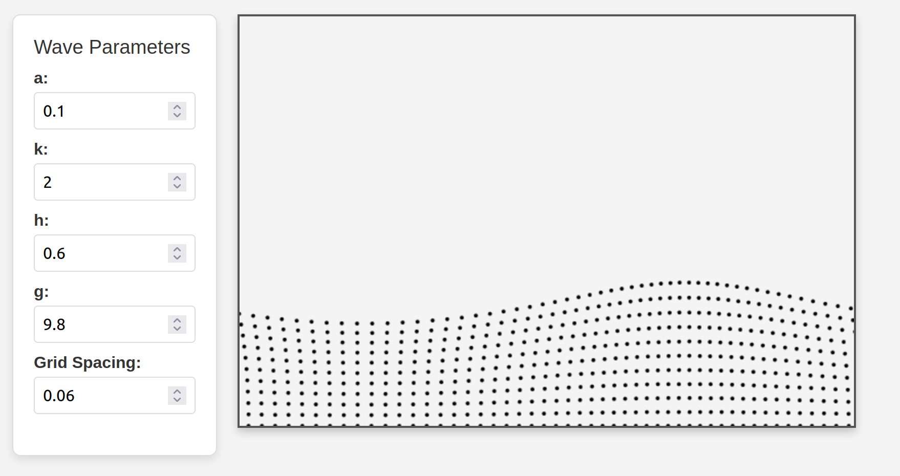

# Airy linear wave animation

Visualize the fundamental plane-wave solutions to Airy's linear wave equation. The mathematical details are very nicely summarized [in Wikipedia](https://en.wikipedia.org/wiki/Airy_wave_theory).

The movement of water that takes place under the wave's surface explains why water depth is such an important factor in determining wave velocity.

The elliptical motion of individual water particles may be familiar to those who have snorkeled in shallow water.

## [Click here for the interactive animation](https://maresb.github.io/airy-wave/)

## Mathematical details

In short, the velocity $v$ of a water wave is given by the dispersion relation

$$
v^2 = \frac{g\lambda}{2\pi}\tanh\frac{2\pi h}{\lambda}
$$

where $g$ is gravitational acceleration, $h$ is water depth, and $\lambda$ is the wavelength. This dispersion relation determines all dynamics of water waves in the small-ampltude limit.

Special cases of this formula are the deep and shallow limits:

$$\begin{align}
    v &\approx \sqrt{\frac{g\lambda}{2\pi}} & \textrm{as } h &\to \infty, \\
    v &\approx \sqrt{gh} & \textrm{as } h &\to 0.
\end{align}$$

## Why are the dynamics determined by this dispersion relation?

More mathematically-amenable quantities are the angular wavenumber $k = 2\pi/\lambda$, and angular frequency $\omega = k v$. In terms of these quantities the relation becomes

$$
\omega^2 = g k \tanh(k h).
$$

In particular, given any initial conditions for the surface $z=\eta(x,0)$ and $\partial\eta/\partial t(x,0)$ in the small-amplitude limit, then the time evolution is determined by evolving the individual Fourier modes according to

$$\exp(i (kx-\omega t)).$$

For any $k\neq 0$ there is a pair of values $\pm \omega$ and hence a pair of Fourier coefficients $C_{k,+\omega}$, $C_{k,-\omega}$ that can be matched to the pair of $k$-Fourier coefficients coming from the initial conditions.

## What are the assumptions?

The primary assumption is that the amplitude $a$ of the waves is small so that second-order effects are negligible. (If the envelope of the surface wave is distorted from a pure sinusoid, then the amplitude $a$ has been set too large.)

The dispersion relation arises from exactly solving the PDE of the fluid motion under the surface. That PDE is [Bernoulli's equation](https://en.wikipedia.org/wiki/Bernoulli%27s_principle#Unsteady_potential_flow) and assumes that water is incompressible and irrotational. While water is certainly not irrotational, it is still a convenient assumption since rotational effects don't play a very significant role in small waves.
